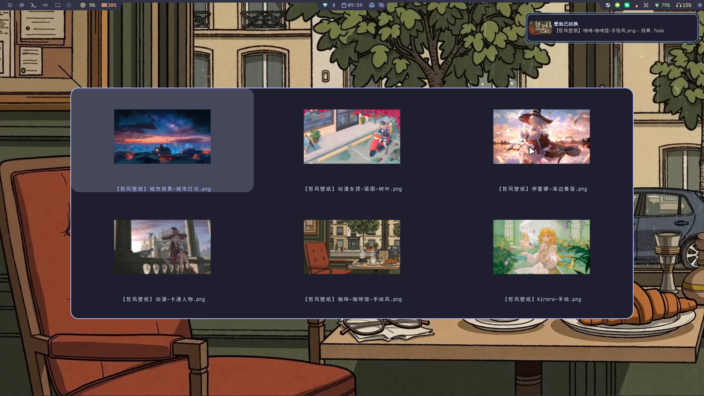

## Kaelwen的nixos配置

桌面环境：niri

桌面组件：

| 组件     | 功能                         |
| -------- | ---------------------------- |
| waybar   | 顶栏                         |
| rofi     | 程序选择器/剪贴板/壁纸切换器 |
| swayidle | 自动熄屏                     |
| swaylock | 锁屏                         |
| mako     | 通知                         |
| wlsunset | 护眼模式                     |
| awww     | 壁纸                         |

- 主题配色管理：stylix
- shell：fish

> 也不一定是rofi，有时候用用fuzzel
> 也有可能直接换成noctalia了

### 展示

#### waybar

#### rofi

- 程序选择
  

- 壁纸切换
  

---

## 待修改

1. 双系统还没搞
2. 继续研究flake-parts，没搞懂template怎么用的
3. 完善一下nixvim

---
