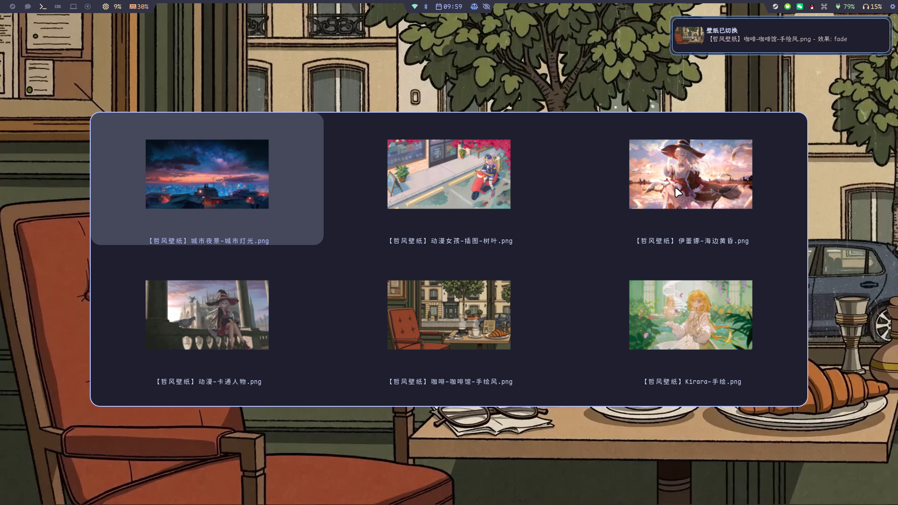

## yaellona的nixos配置

桌面环境：niri

桌面组件（激活）：

| 组件     | 功能                         |
| -------- | ---------------------------- |
| noctalia | 顶栏/启动器/剪贴板/壁纸一体化 |
| fcitx5   | 中文输入（rime）             |
| swayidle | 自动熄屏（disabled/ 备份）   |

> 停用组件备份在 `modules/home/desktop/disabled/`（waybar、mako、swaync、rofi/fuzzel 等），恢复时移回启用即可。

- 主题配色管理：stylix
- shell：fish
- 壁纸：`assets/waypapers/`

### 展示

#### waybar

#### rofi

- 程序选择
  

- 壁纸切换
  

---

## 待修改

1. 双系统还没搞
2. nixvim / vscode 配置（`disabled/` 里暂停维护）
3. 完善 noctalia

---